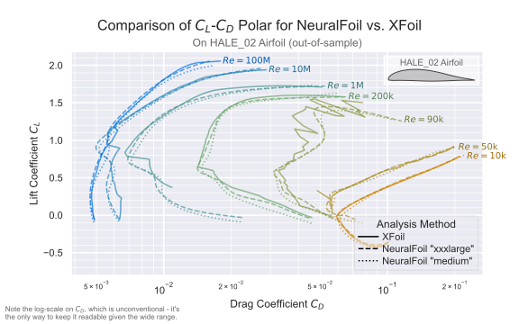

<p align="center">
    
</p>

by Peter Sharpe

-----

NeuralFoil is a small Python/NumPy tool for rapid aerodynamics analysis of airfoils. Under the hood, it consists of a neural network trained on tens of millions of [XFoil](https://web.mit.edu/drela/Public/web/xfoil/) runs. NeuralFoil aims to be lightweight, with [minimal dependencies](#dependencies-question) and a [tight, efficient code-base](./neuralfoil).

NeuralFoil is ~10x faster than XFoil for a single analysis, and ~1000x faster for multipoint analysis, all with [minimal loss in accuracy compared to XFoil](#performance). It also has [many nice features](#xfoil-benefit-question) (e.g., smoothness, vectorization, all in Python/NumPy) that make it much easier to use.

## Overview

NeuralFoil comes with 8 different neural network models, with increasing levels of complexity:

<div align="center">
	<table>
	 <tr>
		<td>"xxsmall"</td>
		<td>"xsmall"</td>
		<td>"small"</td>
		<td>"medium"</td>
		<td>"large"</td>
		<td>"xlarge"</td>
		<td>"xxlarge"</td>
		<td>"xxxlarge"</td>
	 </tr>
	</table>
</div>

This spectrum offers a tradeoff between accuracy and computational cost.

In addition to its neural network models, NeuralFoil also has a bonus "Linear $C_L$ model" that predicts lift coefficient $C_L$ as a purely-linear function of angle of attack $\alpha$. This model is well-suited for linear lifting-line or blade-element-method analyses, where the $C_L(\alpha)$ linearity can be used to solve the resulting system of equations "in one shot" as a linear solve, rather than a less-numerically-robust iterative nonlinear solve.

Using NeuralFoil is dead-simple, and also offers several possible "entry points" for inputs. Here's an example showing this:

```python
import neuralfoil as nf
import numpy as np

aero = nf.get_aero_from_dat_file(  # You can use a .dat file as an entry point
    dat_file_path="/path/to/my_airfoil_file.dat",
    alpha=5,  # Angle of attack [deg]
    Re=5e6,  # Reynolds number [-]
    model_size="xlarge",  # Optionally, specify your model size.
)

aero = nf.get_aero_from_coordinates(  # You can use xy airfoil coordinates as an entry point
    coordinates=n_by_2_numpy_ndarray_of_airfoil_coordinates,
    alpha=np.linspace(-25, 25, 1000),  # Vectorize your evaluations across `alpha` and `Re`
    Re=5e6,
)

aero = nf.get_aero_from_airfoil(  # You can AeroSandbox airfoils as an entry point
    airfoil=asb.Airfoil("naca4412"),  # `import aerosandbox as asb`, any UIUC or NACA airfoil name works
    alpha=5, Re=5e6,
)

# `aero` is a dict with keys: ["CL", "CD", "CM", "Cpmin", "Top_Xtr", "Bot_Xtr"]
```

## Performance

Qualitatively, NeuralFoil tracks XFoil very closely across a wide range of $\alpha$ and $Re$ values. In the figure below, we compare the performance of NeuralFoil to XFoil on $C_L$-$C_D$ polar prediction. Notably, the airfoil analyzed here was developed "from scratch" for a real-world aircraft development program and is completely separate from [the airfoils used during NeuralFoil's training](#geometry-parameterization-and-training-data), so NeuralFoil isn't cheating by "memorizing" this airfoil's performance: 

<p align="center">
	
</p>

NeuralFoil is typically accurate to within a few percent of XFoil's predictions. The error is largest at transitional $Re$ where the physics is the most nuanced, but is still quite close. NeuralFoil also [has the benefit of smoothing out XFoil's "jagged" predictions](#xfoil-benefit-question) (for example, near $C_L=0.75$ in the $Re=\mathrm{1M}$ case, where the bottom-surface boundary layer suddenly laminarizes, and the drag plummets), which would otherwise make optimization difficult. 

In the table below, we quantify the performance of the NeuralFoil ("NF") models with respect to XFoil more precisely. At a basic level, we care about two things:

- **Accuracy**: how close are the predictions to XFoil's?
- **Computational Cost**: how long does it take to run?

This table details both of these considerations. The first few columns show the error with respect to XFoil on the test dataset. [The test dataset is completely isolated from the training dataset, and NeuralFoil was not allowed to learn from the test dataset](#geometry-parameterization-and-training-data). Thus, the performance on the test dataset gives a good idea of NeuralFoil's performance "in the wild".

<table><thead><tr><th>Aerodynamics Model</th><th colspan="6">Mean Absolute Error (MAE) of Given Metric, on the Test Dataset, with respect to XFoil</th><th colspan="2">Computational Cost to Run</th></tr></thead><tbody><tr><td></td><td>Lift Coeff.<br>$C_L$</td><td>Fractional Drag Coeff.<br>$\ln(C_D)$   †</td><td>Moment Coeff.<br>$C_M$</td><td>Max Overspeed<br>$u_\max / u_\infty$&nbsp;&nbsp;&nbsp;‡</td><td>Top Transition Loc.<br>$x_{tr, top}/c$</td><td>Bottom Trans. Loc.<br>$x_{tr, bot}/c$</td><td>Runtime<br>(1 run)</td><td>Total Runtime<br>(100,000 runs)</td></tr><tr><td>NF Linear $C_L$ Model</td><td>0.116</td><td>-</td><td>-</td><td>-</td><td>-</td><td>-</td><td>18 ms</td><td>0.020 s</td></tr><tr><td>NF "xxsmall"</td><td>0.065</td><td>0.121</td><td>0.010</td><td>0.215</td><td>0.073</td><td>0.100</td><td>27 ms</td><td>0.204 sec</td></tr><tr><td>NF "xsmall"</td><td>0.042</td><td>0.075</td><td>0.007</td><td>0.134</td><td>0.039</td><td>0.055</td><td>29 ms</td><td>0.304 s</td></tr><tr><td>NF "small"</td><td>0.039</td><td>0.069</td><td>0.006</td><td>0.122</td><td>0.036</td><td>0.050</td><td>31 ms</td><td>0.437 s</td></tr><tr><td>NF "medium"</td><td>0.027</td><td>0.051</td><td>0.004</td><td>0.088</td><td>0.022</td><td>0.033</td><td>33 ms</td><td>0.749 s</td></tr><tr><td>NF "large"</td><td>0.024</td><td>0.045</td><td>0.004</td><td>0.079</td><td>0.020</td><td>0.029</td><td>35 ms</td><td>1.542 s</td></tr><tr><td>NF "xlarge"</td><td>0.023</td><td>0.043</td><td>0.004</td><td>0.076</td><td>0.019</td><td>0.028</td><td>36 ms</td><td>3.495 s</td></tr><tr><td>NF "xxlarge"</td><td>0.021</td><td>0.040</td><td>0.003</td><td>0.071</td><td>0.018</td><td>0.025</td><td>39 ms</td><td>4.557 s</td></tr><tr><td>NF "xxxlarge"</td><td>0.020</td><td>0.039</td><td>0.003</td><td>0.070</td><td>0.016</td><td>0.024</td><td>65 ms</td><td>11.633 s</td></tr><tr><td>XFoil</td><td>0</td><td>0</td><td>0</td><td>0</td><td>0</td><td>0</td><td>447 ms</td><td>3610 sec</td></tr></tbody></table>

† The deviation of $\ln(C_D)$ can be thought of as "the typical relative error in $C_D$". For example, if the mean absolute error ("MAE", or $L^1$ norm) of $\ln(C_D)$ is 0.051, you can think of it as "typically, drag is accurate to within roughly 5.1%".

‡ This "maximum overspeed" lets you compute $C_{p,\min}$, which can be used to calculate the critical Mach number $M_\mathrm{crit}$. [More details below.](#compressibility-question)

Based on these performance numbers, you can select the right tradeoff between accuracy and computational cost for your application. In general, I recommend starting with the "large" model and adjusting from there.

In addition to accuracy vs. speed, another consideration when choosing the right model is what you're trying to use NeuralFoil for. Larger models will be more complicated ("less parsimonious," as the math kids would say), which means that they may have more "wiggles" in their outputs—this might be undesirable for gradient-based optimization. On the other hand, larger models will be able to capture a wider range of airfoils (e.g., nonsensical, weirdly-shaped airfoils that might be seen mid-optimization), so larger models could have a benefit in that sense. If you try a specific application and have better/worse results with a specific model, let me know by opening a GitHub issue!

Notably, most of the computational overhead of calling NeuralFoil is actually in the airfoil preprocessing step, where the airfoil is converted from a set of coordinates to a CST (Kulfan) parameterization ([more info here](#geometry-parameterization-and-training-data)) - not in the aerodynamics analysis itself. This pre-processing takes around 20 milliseconds using [AeroSandbox's general nonlinear solvers](https://github.com/peterdsharpe/AeroSandbox/blob/c20bea3b142b61a7ad284dbe7632fbd9d5e232a6/aerosandbox/geometry/airfoil/airfoil_families.py#L265), but in theory a pure-NumPy implementation is possible that would be much faster by exploiting linearity (sub-millisecond). If you're interested in working on this, open an issue and let me know! In the meantime, you can eliminate this overhead by using [`get_aero_from_kulfan_parameters()`](./neuralfoil/neuralfoil.py) as opposed to one of NeuralFoil's other functions.

## Installation

<a name="dependencies-question"></a>
To run models, NeuralFoil currently requires minimal dependencies:

* Python 3.7+
* [NumPy](https://numpy.org/)
* [AeroSandbox](https://github.com/peterdsharpe/AeroSandbox) 4.0.10+

Currently, NeuralFoil only uses AeroSandbox for airfoil geometry parameterization (i.e., converting from a set of points to a CST parameterization, which is solved as an optimization problem)—the actual math is implemented in pure NumPy. Recent progress on this CST parameterization-fitting problem has allowed it to be recast as a least-squares problem, which is potentially amenable to a pure-NumPy implementation. That being said, AeroSandbox provides a bunch of nice peripheral utilities (e.g., geometry manipulation, visualization, etc.), so it's a nice dependency to have anyway. However, if you'd like to work on a pure-NumPy implementation, open an issue and let me know!

## Geometry Parameterization and Training Data

## FAQs

Will NeuralFoil be integrated directly into [AeroSandbox](https://github.com/peterdsharpe/AeroSandbox)?

> Yes, absolutely. However, the goal is to keep this NeuralFoil repository also available as a stand-alone module, if desired. This simplifies dependencies for people using NeuralFoil in other applications (e.g., flight simulation, real-time control on embedded systems, etc.), and makes it easier if someone wanted to port NeuralFoil to another language (e.g., C++, for use on an Arduino).

<a name="xfoil-benefit-question"></a>
Why not just use XFoil directly?

> XFoil is a truly excellent piece of aerospace software engineering and is the gold standard of airfoil analysis, for good reason. When its assumptions hold (airfoils in subsonic flow without massive separation), its accuracy exceeds that of RANS CFD, yet it has ~1000x lower computational cost. XFoil shines in particular for human-in-the-loop airfoil design. However, XFoil is not the right tool for all applications, for a few reasons:
>
> - XFoil exhibits hysteresis: you can get slightly different solutions (for the same airfoil, $\alpha$, and $Re$) depending on whether you sweep $\alpha$ up or down, as Newton iteration is resumed from the last converged solution and uniqueness is not guaranteed. This hysteresis can be a big problem for design optimization.
> - XFoil is not differentiable, in the sense that it doesn't tell you how performance changes w.r.t. airfoil shape (via, for example, an adjoint). That's okay—NeuralFoil doesn't either, at least out-of-the-box. However, the "path to obtain an efficient gradient" is very straightforward for NeuralFoil's pure NumPy code, where many excellent options exist (e.g., JAX). In contrast, gradient options XFoil's Fortran code either don't exist or are significantly less advanced (e.g., Tapenade).
> - XFoil's solutions lack $C^1$-continuity. NeuralFoil, by contrast, is guaranteed to be $C^\infty$-continuous by construction. This is critical for gradient-based optimization.
> 	- Even if one tries to compute gradients of XFoil's outputs by finite-differencing or complex-stepping, these gradients are often inaccurate.
>   - A bit into the weeds, but: this comes down to how XFoil handles transition (onset of turbulence). XFoil does a cut-cell approach on the transitioning interval, and while this specific cut-cell implementation restores $C^0$-continuity (i.e., transition won't truly "jump" from one node to another discretely), gradients of the laminar and turbulent BL closure functions still change at the cell interface due to the differing BL parameters ($H$ and $Re_\theta$) from node to node. This loses $C^1$ continuity, causing a "ragged" polar at the microscopic level. In theory $C^1$-continuity could be restored by also blending the BL shape variables through the transitioning cell interval, but that unleashes some ugly integrals and is not done in XFoil.
>      - For more on this, see [Adler, Gray, and Martins, "To CFD or not to CFD?..."](http://websites.umich.edu/~mdolaboratory/pdf/Adler2022c.pdf), Figure 7.
> - While XFoil is ~1000x faster than RANS CFD, NeuralFoil [can be another ~1000x faster to evaluate than XFoil](#performance). NeuralFoil is also much easier to interface with on a memory level than XFoil, which means you won't find yourself I/O bound from file reading/writing like you will with XFoil.
> - XFoil is not vectorized, which exacerbates the speed advantage of a (vectorized) neural network when analyzing large batches of airfoil cases simultaneously.
> - XFoil is not guaranteed to produce a solution. Instead, XFoil often crashes when "ambitious" calculations are attempted, rather than producing a less-accurate answer. In some applications, that's okay or even desirable; in others, that's a dealbreaker. Example applications where this is a problem include:
>   - Real-time control, where one wants to estimate forces (e.g., for a MPC trajectory), but you can't have the controller crash if XFoil fails to converge or hangs the CPU.
>   - Flight simulation: similar to real-time control where "a less-accurate answer" is much better than "no answer."
>   - Design optimization, where the optimizer needs "an answer" in order to recover from a bad design point and send the search back to a reasonable design.
> - XFoil can be a serious pain to compile from source, which is often required if running on Mac or Linux (i.e., all supercomputers, some lab computers). NeuralFoil is pure Python and NumPy, so it's easy to install and run anywhere.

Why not use a neural network trained on RANS CFD instead?

> This is not a bad idea, and it has been done (See [Bouhlel, He, and Martins, "Scalable gradient-enhanced artificial..."](https://link.springer.com/article/10.1007/s00158-020-02488-5))! The fundamental challenge here, of course, is the cost of training data. RANS CFD is much more expensive than XFoil, so it's much harder to get the training data needed to train a neural network. For example, in the linked work by Bouhlel et al., the authors trained a neural network on 42,000 RANS CFD runs (and they were sweeping over Mach as well, so the data becomes even sparser). In contrast, NeuralFoil was trained on tens of millions of XFoil runs. Ultimately, this exposes NeuralFoil to a much larger "span" of the airfoil design space, which is critical for accurate predictions on out-of-sample airfoils.
>
> One advantage of a RANS CFD approach over the NeuralFoil XFoil approach is, of course, transonic modeling. NeuralFoil attempts to get around this a little bit by estimating $C_{p, min}$, which in turn directly quantifies the critical Mach number (beyond which simple models, like normal-shock total-pressure-loss relations or the [Korn equation heuristic](https://archive.aoe.vt.edu/mason/Mason_f/ConfigAeroTransonics.pdf), can be used to extend the Mach region of validity slightly further). But fundamentally, NeuralFoil is likely less accurate in the transonic range because of this. The tradeoff is that the much larger training data set allows NeuralFoil to be more accurate in the subsonic range, where XFoil is more accurate than RANS CFD.

Why not use a neural network trained on wind tunnel data?

> This is a super-cool idea, and I'd love to see someone try it! My guess is that you'd need some kind of morphing wing section (and a way of precisely measuring the shape) in order to get enough data samples to "span" the airfoil design space. Then, you'd just let the wing section sit in the wind tunnel for a few days morphing itself around to collect data, then train a model on that. This would be really awesome, someone should do it!

<a name="compressibility-question"></a>
NeuralFoil is trained on incompressible ($M=0$) XFoil data. Why not train on compressible ($M>0$) XFoil data? Also, how can I use NeuralFoil to predict compressible airfoil performance?

> To be written. But basically: $u_\max / u_\infty$ from NeuralFoil $\longrightarrow C_{p, \min, M=0} \longrightarrow C_{p, \min}$ using Prandtl-Glauert correction $\longrightarrow$ compare to $C_{p,\mathrm{sonic}}$ to determine the extent to which $M_\mathrm{crit}$ is exceeded.

<a name="parameterization-question"></a>
Why parameterize the airfoil geometry using the CST (Kulfan) parameterization? What exactly does the CST parameterization mean, and how can I convert this parameterization to/from actual airfoil coordinates? Why discretize with 8 CST modes per side? Can NeuralFoil accurately analyze airfoils with thick trailing edges?

> To be written, but in the meantime read:
> - [D. A. Masters, "Geometric Comparison of Aerofoil Shape Parameterization Methods", AIAA Journal, 2017.](https://arc.aiaa.org/doi/pdf/10.2514/1.J054943)
> - The seminal paper on the CST (Kulfan) parameterization technique: [Brenda Kulfan, "Universal Parametric Geometry Representation Method"](http://mx1.brendakulfan.com/docs/CST6.pdf)

## License

NeuralFoil is licensed under the MIT license. Please see the [LICENSE](LICENSE.txt) file for details.

## Citing NeuralFoil

If you use NeuralFoil in your research, please cite it as follows:

```
@misc{neuralfoil,
  author = {Peter Sharpe},
  title = {{NeuralFoil}: An airfoil aerodynamics analysis tool using physics-informed machine learning},
  year = {2023},
  publisher = {GitHub},
  journal = {GitHub repository},
  howpublished = {\url{https://github.com/peterdsharpe/NeuralFoil}},
```

[](https://travis-ci.org/NeuralFoil/NeuralFoil)
[](https://codecov.io/gh/NeuralFoil/NeuralFoil)
[](https://neuralfoil.readthedocs.io/en/latest/?badge=latest)
[](https://badge.fury.io/py/neuralfoil)
[](https://opensource.org/licenses/MIT)