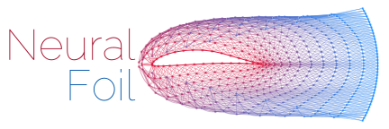

<p align="center">
    
</p>

by Peter Sharpe

-----

NeuralFoil is a small, simple tool for rapid aerodynamics analysis of airfoils. Under the hood, it consists of a neural network trained on tens of millions of XFoil runs. 


## Installation and Usage

## FAQs

Why not just use XFoil directly?

> XFoil is a truly excellent piece of aerospace software engineering and is the gold standard of airfoil analysis, for good reason. When its assumptions hold (airfoils in subsonic flow without massive separation), its accuracy exceeds that of RANS CFD, yet it has ~1000x lower computational cost. XFoil shines in particular for human-in-the-loop airfoil design. However, XFoil is not the right tool for all applications, for a few reasons:
> - XFoil exhibits hysteresis: you can get slightly different solutions (for the same airfoil, $\alpha$, and $Re$) depending on whether you sweep $\alpha$ up or down, as Newton iteration is resumed from the last converged solution and uniqueness is not guaranteed. This hysteresis can be a big problem for design optimization.
> - XFoil is not differentiable, in the sense that it doesn't tell you how performance changes w.r.t. airfoil shape (via, for example, an adjoint). That's okay - NeuralFoil doesn't either, at least out-of-the-box. However, the "path to obtain an efficient gradient" is very straightforward for NeuralFoil's pure NumPy code, where many excellent options exist (e.g., JAX). In contrast, gradient options XFoil's Fortran code either don't exist or are significantly less advanced (e.g., Tapenade). 
> - XFoil's solutions lack $C_1$-continuity. NeuralFoil, by contrast, is guaranteed to be $C_\infty$-continuous by construction. This is critical for gradient-based optimization.
>   - Even if one tries to compute gradients of XFoil's outputs by finite-differencing or complex-stepping, these gradients are often inaccurate. 
>     - A bit into the weeds, but: this comes down to how XFoil handles transition (onset of turbulence). XFoil does a cut-cell approach on the transitioning interval, and while this specific cut-cell implementation restores $C_0$-continuity (i.e., transition won't truly "jump" from one node to another discretely), gradients of the laminar and turbulent BL closure functions still change at the cell interface due to the differing BL shape variables ($H$ and $Re_\theta$) from node to node. This loses $C_1$ continuity, causing a "ragged" polar at the microscopic level. In theory $C_1$-continuity could be restored by also blending the BL shape variables through the transitioning cell interval, but that unleashes some ugly integrals and is not done in XFoil.
>   - For more on this, see [Adler, Gray, and Martins, "To CFD or not to CFD?..."](http://websites.umich.edu/~mdolaboratory/pdf/Adler2022c.pdf), Figure 7.
> - In some applications (e.g., real-time control), XFoil's speed is a bottleneck. NeuralFoil is ~1000x faster than XFoil, so it's much better suited for these applications.
> - XFoil is not vectorized, which exacerbates the speed advantage of a (vectorized) neural network when analyzing large batches of airfoil cases simultaneously.
> - XFoil is not guaranteed to produce a solution. Instead, XFoil often crashes when "ambitious" calculations are attempted, rather than producing a less-accurate answer. In some applications, that's okay or even desirable; in others, that's a dealbreaker. Example applications where this is a problem include:
>   - Real-time control, where one wants to estimate forces (e.g., for a MPC trajectory), but you can't have the controller crash if XFoil fails to converge or hangs the CPU.
>   - Flight simulation: similar to real-time control where "a less-accurate answer" is much better than "no answer".
>   - Design optimization, where the optimizer needs "an answer" in order to recover from a bad design point and send the search back to a reasonable design.
>   - 
> - XFoil can be a serious pain to compile from source, which is often required if running on Mac or Linux (i.e., all supercomputers, some lab computers). NeuralFoil is pure Python and NumPy, so it's easy to install and run anywhere. 
  
Why not use a neural network trained on RANS CFD instead?

> This is not a bad idea, and it has been done (See [Bouhlel, He, and Martins, "Scalable gradient-enhanced artificial..."](https://link.springer.com/article/10.1007/s00158-020-02488-5))! The fundamental challenge here, of course, is the cost of training data. RANS CFD is much more expensive than XFoil, so it's much harder to get the training data needed to train a neural network. For example, in the linked work by Bouhlel et al., the authors trained a neural network on 42,000 RANS CFD runs (and they were sweeping over Mach as well, so the data becomes even more sparse). In contrast, NeuralFoil was trained on 12,000,000 XFoil runs. Ultimately, this exposes NeuralFoil to a much larger "span" of the airfoil design space, which is critical for accurate predictions on out-of-sample airfoils.
> 
> One advantage of a RANS CFD approach over the NeuralFoil XFoil approach is, of course, transonic modeling. NeuralFoil attempts to get around this a little bit by estimating $C_{p, min}$, which in turn directly quantifies the critical Mach number (beyond which simple models, like normal-shock total-pressure-loss relations or the [Korn equation heuristic](https://archive.aoe.vt.edu/mason/Mason_f/ConfigAeroTransonics.pdf), can be used to extend the Mach region of validity slightly further). But fundamentally, NeuralFoil is likely less accurate in the transonic range because of this. The tradeoff is that the much larger training data set allows NeuralFoil to be more accurate in the subsonic range, where XFoil is more accurate than RANS CFD.

Why not use a neural network trained on wind tunnel data?

> This is a super-cool idea, and I'd love to see someone try it! My guess is that you'd need some kind of morphing wing section (and a way of precisely measuring the shape) in order to get enough data samples to "span" the airfoil design space. Then, you'd just let the wing section sit in the wind tunnel for a few days morphing itself around to collect data, then train a model on that. This would be really awesome, someone should do it!


## License

NeuralFoil is licensed under the MIT license. Please see the [LICENSE](LICENSE.txt) file for details.

## Citing NeuralFoil

If you use NeuralFoil in your research, please cite it as follows:
```
@misc{neuralfoil,
  author = {Peter Sharpe},
  title = {NeuralFoil: An airfoil analysis tool based on neural networks trained on XFoil data},
  year = {2020},
  publisher = {GitHub},
  journal = {GitHub repository},
  howpublished = {\url{
```


[](https://travis-ci.org/NeuralFoil/NeuralFoil)
[](https://codecov.io/gh/NeuralFoil/NeuralFoil)
[](https://neuralfoil.readthedocs.io/en/latest/?badge=latest)
[](https://badge.fury.io/py/neuralfoil)
[](https://opensource.org/licenses/MIT)