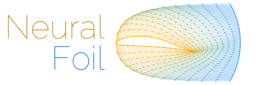
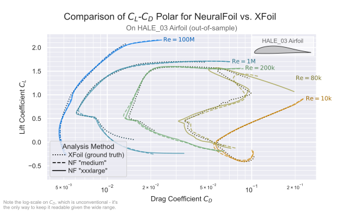
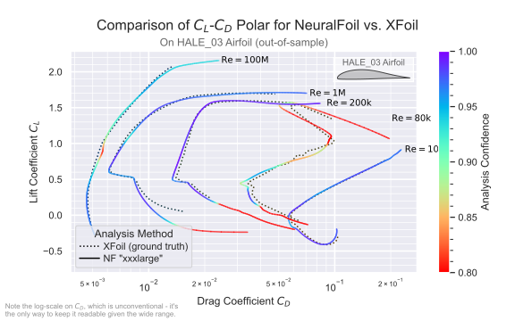
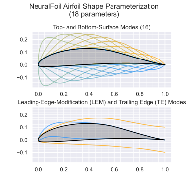

<p align="center">
    
</p>

by [Peter Sharpe](https://peterdsharpe.github.io) (<pds [at] mit [dot] edu>)

[](https://pypi.org/project/NeuralFoil/)
[](https://github.com/peterdsharpe/NeuralFoil/actions/workflows/run-pytest.yml)
[](https://opensource.org/licenses/MIT)

-----

NeuralFoil is a tool for rapid aerodynamics analysis of airfoils, similar to [XFoil](https://web.mit.edu/drela/Public/web/xfoil/). Under the hood, NeuralFoil consists of physics-informed neural networks trained on [tens of millions of XFoil runs](#geometry-parameterization-and-training-data).

NeuralFoil is available here as a pure Python+NumPy standalone, but it is also [available within AeroSandbox](#extended-features-transonics-post-stall-control-surface-deflections), which extends it with many more advanced features. Using the AeroSandbox extension, NeuralFoil can give you **viscous, compressible airfoil aerodynamics for (nearly) any airfoil, with control surface deflections, across $360^\circ$ angle of attack, at any Reynolds number, all nearly instantly** (~5 milliseconds). And, it's guaranteed to return an answer (no non-convergence issues), it's vectorized, and it's $C^\infty$-continuous (critical for gradient-based optimization). 

For aerodynamics experts: NeuralFoil will also give you fine-grained boundary layer control ($N_{\rm crit}$, forced trips) and inspection results ($\theta$, $H$, $u_e/V_\infty$, and pressure distributions).

A unique feature of NeuralFoil is that every analysis will also return an `"analysis_confidence"` output, which is a measure of uncertainty. This is especially useful for design optimization, where constraining this uncertainty parameter will help ensure your designs are [robust to small changes in shape and flow conditions.](https://web.mit.edu/drela/OldFiles/Public/papers/Pros_Cons_Airfoil_Optimization.pdf)

NeuralFoil is [~10x faster than XFoil for a single analysis, and ~1000x faster for multipoint analysis](#table), all with [minimal loss in accuracy compared to XFoil](#performance). Due to the wide variety of training data and the embedding of several physics-based invariants, [this accuracy is seen even on out-of-sample airfoils](#performance) (i.e., airfoils it wasn't trained on). It also has [many nice features](#xfoil-benefit-question) (e.g., smoothness, vectorization, all in Python+NumPy) that make it much easier to use.

NeuralFoil aims to be lightweight, with [minimal dependencies](#dependencies-question) and a [tight, efficient, and easily-understood code-base](./neuralfoil/gen1_architecture) (less than 500 lines of user-facing code).

```
pip install neuralfoil
```

[For example usage of NeuralFoil, see the AeroSandbox tutorials](https://github.com/peterdsharpe/AeroSandbox/tree/master/tutorial/06%20-%20Aerodynamics/02%20-%20AeroSandbox%202D%20Aerodynamics%20Tools).

## Overview

NeuralFoil comes with 8 different neural network models, with increasing levels of complexity:

<div align="center">
    <table>
     <tr>
        <td>"xxsmall"</td>
        <td>"xsmall"</td>
        <td>"small"</td>
        <td>"medium"</td>
        <td>"large"</td>
        <td>"xlarge"</td>
        <td>"xxlarge"</td>
        <td>"xxxlarge"</td>
     </tr>
    </table>
</div>

This spectrum offers a tradeoff between accuracy and computational cost.

In addition to its neural network models, NeuralFoil also has a bonus "Linear $C_L$ model" that predicts lift coefficient $C_L$ as a purely-affine function of angle of attack $\alpha$. This model is well-suited for linear lifting-line or blade-element-method analyses, where the $C_L(\alpha)$ linearity can be used to solve the resulting system of equations "in one shot" as a linear solve, rather than a less-numerically-robust iterative nonlinear solve.

Using NeuralFoil is dead-simple, and also offers several possible "entry points" for inputs. Here's an example showing this:

```python
import neuralfoil as nf  # `pip install neuralfoil`
import numpy as np

aero = nf.get_aero_from_dat_file(  # You can use a .dat file as an entry point
    dat_file_path="/path/to/my_airfoil_file.dat",
    alpha=5,  # Angle of attack [deg]
    Re=5e6,  # Reynolds number [-]
    model_size="xlarge",  # Optionally, specify your model size.
)

aero = nf.get_aero_from_coordinates(  # You can use xy airfoil coordinates as an entry point
    coordinates=n_by_2_numpy_ndarray_of_airfoil_coordinates,
    alpha=np.linspace(-25, 25, 1000),  # Vectorize your evaluations across `alpha` and `Re`
    Re=5e6,
)

aero = nf.get_aero_from_airfoil(  # You can use AeroSandbox airfoils as an entry point
    airfoil=asb.Airfoil("naca4412"),  # `import aerosandbox as asb`, any UIUC or NACA airfoil name works
    alpha=5, Re=5e6,
)

# `aero` is a dictionary with keys: ["CL", "CD", "CM", "Cpmin", "Top_Xtr", "Bot_Xtr"]
```

## Performance

Qualitatively, NeuralFoil tracks XFoil very closely across a wide range of $\alpha$ and $Re$ values. In the figure below, we compare the performance of NeuralFoil to XFoil on $C_L, C_D$ polar prediction. Notably, the airfoil analyzed here was developed "from scratch" for a [real-world aircraft development program](https://www.prnewswire.com/news-releases/electra-flies-solar-electric-hybrid-research-aircraft-301633713.html) and is completely separate from [the airfoils used during NeuralFoil's training](#geometry-parameterization-and-training-data), so NeuralFoil isn't cheating by "memorizing" this airfoil's performance. Each color in the figure below represents analyses at a different Reynolds number.

<a name="clcd-polar"></a>

<p align="center">
    
</p>

NeuralFoil is typically accurate to within a few percent of XFoil's predictions. Note that this figure is on a truly out-of-sample airfoil, so airfoils that are closer to the training set will have even more accurate results.

NeuralFoil also [has the benefit of smoothing out XFoil's "jagged" predictions](#xfoil-benefit-question) (for example, near $C_L=1.4$ at $Re=\mathrm{80k}$) in cases where XFoil is not reliably converging, which would otherwise make optimization difficult. On that note, NeuralFoil will also give you an `"analysis_confidence"` output, which is a measure of uncertainty. Below, we show the same figure as before, but color the NeuralFoil results by analysis confidence. This illustrates how regions with delicate or uncertain aerodynamic behavior are flagged.

<p align="center">
	
</p>


In the table below, we quantify the performance of the NeuralFoil ("NF") models with respect to XFoil more precisely. At a basic level, we care about two things:

- **Accuracy**: how close are the predictions to XFoil's?
- **Computational Cost**: how long does it take to run?

This table details both of these considerations. The first few columns show the error with respect to XFoil on the test dataset. [The test dataset is completely isolated from the training dataset, and NeuralFoil was not allowed to learn from the test dataset](#geometry-parameterization-and-training-data). Thus, the performance on the test dataset gives a good idea of NeuralFoil's performance "in the wild". The second set of columns gives the runtime speed of the models, both for a single analysis and for a large batch analysis.

<table><thead><tr><th>Aerodynamics Model</th><th colspan="4">Mean Absolute Error (MAE) of Given Metric, on the Test Dataset, with respect to XFoil</th><th colspan="2">Computational Cost to Run</th></tr></thead><tbody><tr><td></td><td>Lift Coeff.<br>$C_L$</td><td>Fractional Drag Coeff.<br>$\ln(C_D)$&nbsp;&nbsp;&nbsp;†</td><td>Moment Coeff.<br>$C_M$</td><td>Transition Locations<br>$x_{tr}/c$</td><td>Runtime<br>(1 run)</td><td>Total Runtime<br>(100,000 runs)</td></tr><tr><td>NF "xxsmall"</td><td>0.040</td><td>0.078</td><td>0.007</td><td>0.044</td><td>4 ms</td><td>0.85 sec</td></tr><tr><td>NF "xsmall"</td><td>0.030</td><td>0.057</td><td>0.005</td><td>0.033</td><td>4 ms</td><td>0.96 sec</td></tr><tr><td>NF "small"</td><td>0.027</td><td>0.050</td><td>0.005</td><td>0.027</td><td>5 ms</td><td>1.08 sec</td></tr><tr><td>NF "medium"</td><td>0.020</td><td>0.039</td><td>0.003</td><td>0.020</td><td>5 ms</td><td>1.29 sec</td></tr><tr><td>NF "large"</td><td>0.016</td><td>0.030</td><td>0.003</td><td>0.014</td><td>8 ms</td><td>2.23 sec</td></tr><tr><td>NF "xlarge"</td><td>0.013</td><td>0.024</td><td>0.002</td><td>0.010</td><td>13 ms</td><td>4.21 sec</td></tr><tr><td>NF "xxlarge"</td><td>0.012</td><td>0.022</td><td>0.002</td><td>0.009</td><td>16 ms</td><td>5.16 sec</td></tr><tr><td>NF "xxxlarge"</td><td>0.012</td><td>0.020</td><td>0.002</td><td>0.007</td><td>56 ms</td><td>13.6 sec</td></tr><tr><td>XFoil</td><td>0</td><td>0</td><td>0</td><td>0</td><td>73 ms</td><td>42 min</td></tr></tbody></table>

> † The deviation of $\ln(C_D)$ can be thought of as "the typical relative error in $C_D$". For example, if the mean absolute error ("MAE", or $L^1$ norm) of $\ln(C_D)$ is 0.020, you can think of it as "typically, drag is accurate to within 2.0% of XFoil." Note that this doesn't necessarily mean that NeuralFoil is *less* accurate than XFoil - although XFoil is quite accurate, it is clearly not a perfect "ground truth" in all cases (see $Re=\mathrm{90k}$ in the [figure above](#clcd-polar)). So, NeuralFoil's true accuracy compared to experiment may differ (in either direction) from the numbers in this table.

Based on these performance numbers, you can select the right tradeoff between accuracy and computational cost for your application. In general, I recommend starting with the ["large"](#overview) model and adjusting from there.

In addition to accuracy vs. speed, another consideration when choosing the right model is what you're trying to use NeuralFoil for. Larger models will be more complicated ("less parsimonious," as the math kids would say), which means that they may have more "wiggles" in their outputs as they track XFoil's physics more closely. This might be undesirable for gradient-based optimization. On the other hand, larger models will be able to capture a wider range of airfoils (e.g., nonsensical, weirdly-shaped airfoils that might be seen mid-optimization), so larger models could have a benefit in that sense. If you try a specific application and have better/worse results with a specific model, let me know by opening a GitHub issue!

## Extended Features (transonics, post-stall, control surface deflections)

For more sophisticated airfoil aerodynamics calculations, consider using NeuralFoil via [AeroSandbox](https://github.com/peterdsharpe/AeroSandbox) (specifically, through [`asb.Airfoil.get_aero_from_neuralfoil()`](https://github.com/peterdsharpe/AeroSandbox/blob/8ad83aa4e4e40c503884c722143b7730c08089fa/aerosandbox/geometry/airfoil/airfoil.py#L607)). This provides several advanced features:

* **Compressible aerodynamics**, including transonic and supersonic aerodynamics. AeroSandbox will generally get the critical Mach number accurate to within $\pm 0.01$ or so. Subsonic corrections done using a Laitone correction (a higher-order variant of Prandtl-Glauert and Karman-Tsien). Wave drag accuracy is, of course, less reliable beyond the drag-divergence Mach number, although it still [agrees reasonably closely when compared to RANS CFD](https://github.com/peterdsharpe/AeroSandbox/blob/master/studies/WingTransonics/compare_methods.py).
* **Post-stall aerodynamics** (i.e., truly 360 degree range of $\alpha$). This is useful for applications like wind turbine blades or propeller roots, where the airfoil may be operating at high angles of attack.
* **Control surface deflections**. Currently only trailing-edge control surface deflections are supported in AeroSandbox's NeuralFoil interface.

## Installation

[Install from PyPI](https://pypi.org/project/NeuralFoil/) with `pip install neuralfoil`.

<a name="dependencies-question"></a>
To run models, NeuralFoil currently requires minimal dependencies:

* Python 3.7+
* [NumPy](https://numpy.org/)
* [AeroSandbox](https://github.com/peterdsharpe/AeroSandbox) 4.0.10+

Currently, NeuralFoil only uses AeroSandbox for airfoil geometry parameterization (i.e., converting from a set of points to a CST parameterization, which is solved as an optimization problem)—the actual math is implemented in pure NumPy. Recent progress on this CST parameterization-fitting problem has allowed it to be recast as a least-squares problem, which is potentially amenable to a pure-NumPy implementation. That being said, AeroSandbox provides a bunch of nice peripheral utilities (e.g., geometry manipulation, visualization, etc.), so it's a nice dependency to have anyway. However, if you'd like to work on a pure-NumPy implementation, open an issue and let me know!

## Geometry Parameterization and Training Data

#### Geometry Parameterization

<a name="parameterization-question"></a>

As a user, you can give an airfoil in many different formats—for example, as a set of $(x,y)$ coordinates, as a .dat file, or as an AeroSandbox `Airfoil` object. However, under the hood, NeuralFoil parameterizes the airfoil geometry using the CST (Kulfan) parameterization. (You can also directly pass in Kulfan parameters if preferred.)

The airfoil shape fed into NeuralFoil's neural networks is in the form of an 8-parameter-per-side CST (Kulfan) parameterization, with Kulfan's added leading-edge-modification (LEM) and trailing-edge thickness parameter. This gives a total of (8 * 2 + 1 + 1) = 18 parameters to describe a given airfoil shape.

<p align="center">
    
</p>

For more details on this parameterization, or why it is a good choice, read:

- [D. A. Masters, "Geometric Comparison of Aerofoil Shape Parameterization Methods", AIAA Journal, 2017.](https://arc.aiaa.org/doi/pdf/10.2514/1.J054943)
- The seminal paper on the CST (Kulfan) parameterization technique: [Brenda Kulfan, "Universal Parametric Geometry Representation Method"](http://mx1.brendakulfan.com/docs/CST6.pdf)

To convert between airfoil coordinates and the CST parameterization, use the following functions:

```python
from aerosandbox.geometry.airfoil.airfoil_families import get_kulfan_parameters, get_kulfan_coordinates
```

with documentation [here](https://aerosandbox.readthedocs.io/en/master/autoapi/aerosandbox/geometry/airfoil/airfoil_families/index.html) or in the source ([here](https://github.com/peterdsharpe/AeroSandbox/blob/8ad83aa4e4e40c503884c722143b7730c08089fa/aerosandbox/geometry/airfoil/airfoil_families.py#L128), [here](https://github.com/peterdsharpe/AeroSandbox/blob/8ad83aa4e4e40c503884c722143b7730c08089fa/aerosandbox/geometry/airfoil/airfoil_families.py#L265)).

#### Training Data

To be written, but in the meantime [see here](https://github.com/peterdsharpe/NeuralFoil/tree/master/training_data). Training data is not (yet) uploaded to GitHub, but will be soon - need to figure out Git LFS, as it's many gigabytes. Contact me if you need it sooner.

## FAQs

Will NeuralFoil be integrated directly into [AeroSandbox](https://github.com/peterdsharpe/AeroSandbox)?

> Yes, absolutely. However, the goal is to keep this NeuralFoil repository also available as a stand-alone module, if desired. This simplifies dependencies for people using NeuralFoil in other applications (e.g., flight simulation, real-time control on embedded systems, etc.), and makes it easier if someone wanted to port NeuralFoil to another language (e.g., C++, for use on an Arduino).

<a name="xfoil-benefit-question"></a>
Why not just use XFoil directly?

> XFoil is a truly excellent piece of aerospace software engineering and is the gold standard of airfoil analysis, for good reason. When its assumptions hold (airfoils in subsonic flow without massive separation), its accuracy exceeds that of RANS CFD, yet it has ~1000x lower computational cost. XFoil shines in particular for human-in-the-loop airfoil design. However, XFoil is not the right tool for all applications, for a few reasons:
> 
> - XFoil exhibits hysteresis: you can get slightly different solutions (for the same airfoil, $\alpha$, and $Re$) depending on whether you sweep $\alpha$ up or down, as Newton iteration is resumed from the last converged solution and uniqueness is not guaranteed. This hysteresis can be a big problem for design optimization.
> - XFoil is not differentiable, in the sense that it doesn't tell you how performance changes w.r.t. airfoil shape (via, for example, an adjoint). That's okay—NeuralFoil doesn't either, at least out-of-the-box. However, the "path to obtain an efficient gradient" is very straightforward for NeuralFoil's pure NumPy code, where many excellent options exist (e.g., JAX). In contrast, gradient options for Fortran code (the language XFoil is in) either don't exist or are significantly less advanced (e.g., Tapenade). The most promising option for XFoil is probably [CMPLXFOIL](https://github.com/mdolab/CMPLXFOIL), which computes complex-step (effectively, forward-mode) gradients. However, even if you can get a gradient from XFoil, it still may not be very useful, because...
> - XFoil's solutions lack $C^1$-continuity. NeuralFoil, by contrast, is guaranteed to be $C^\infty$-continuous by construction. This is critical for gradient-based optimization.
>   - Even if one tries to compute gradients of XFoil's outputs by finite-differencing or complex-stepping, these gradients are often inaccurate.
>   - A bit into the weeds, but: this comes down to how XFoil handles transition (onset of turbulence). XFoil does a cut-cell approach on the transitioning interval, and while this specific cut-cell implementation restores $C^0$-continuity (i.e., transition won't truly "jump" from one node to another discretely), gradients of the laminar and turbulent BL closure functions still change at the cell interface due to the differing BL parameters ($H$ and $Re_\theta$) from node to node. This loses $C^1$ continuity, causing a "ragged" polar at the microscopic level. In theory $C^1$-continuity could be restored by also blending the BL shape variables through the transitioning cell interval, but that unleashes some ugly integrals and is not done in XFoil.
>     - For more on this, see [Adler, Gray, and Martins, "To CFD or not to CFD?..."](http://websites.umich.edu/~mdolaboratory/pdf/Adler2022c.pdf), Figure 7.
> - While XFoil is ~1000x faster than RANS CFD, NeuralFoil [can be another ~1000x faster to evaluate than XFoil](#performance). NeuralFoil is also much easier to interface with on a memory level than XFoil, which means you won't find yourself I/O bound from file reading/writing like you will with XFoil.
> - XFoil is not vectorized, which exacerbates the speed advantage of a (vectorized) neural network when analyzing large batches of airfoil cases simultaneously.
> - XFoil is not guaranteed to produce a solution. Instead, XFoil often crashes when "ambitious" calculations are attempted, rather than producing a less-accurate answer. In some applications, that's okay or even desirable; in others, that's a deal-breaker. Example applications where this is a problem include:
>   - Real-time control, where one wants to estimate forces (e.g., for a MPC trajectory), but you can't have the controller crash if XFoil fails to converge or hangs the CPU.
>   - Flight simulation: similar to real-time control where "a less-accurate answer" is much better than "no answer."
>   - Design optimization, where the optimizer needs "an answer" in order to recover from a bad design point and send the search back to a reasonable design.
> - XFoil can be a serious pain to compile from source, which is often required if running on Mac or Linux (i.e., all supercomputers, some lab computers). NeuralFoil is pure Python and NumPy, so it's easy to install and run anywhere.

Why not use a neural network trained on RANS CFD instead?

> This is a cool idea too, and it has been done (See [Bouhlel, He, and Martins, "Scalable gradient-enhanced artificial..."](https://link.springer.com/article/10.1007/s00158-020-02488-5))! The fundamental challenge here, of course, is the cost of training data. RANS CFD is much more expensive than XFoil, so it's much harder to get sufficient training data to build a neural network that will generalize well out-of-sample. For example, in the linked work by Bouhlel et al., the authors trained a neural network on 42,000 RANS CFD runs (and they were sweeping over Mach as well, so the data becomes even sparser). In contrast, NeuralFoil was trained on tens of millions of XFoil runs. Ultimately, this exposes NeuralFoil to a much larger "span" of the airfoil design space, which is critical for accurate predictions on out-of-sample airfoils.
> 
> One advantage of a RANS CFD approach over the NeuralFoil XFoil approach is, of course, transonic modeling. NeuralFoil attempts to get around this a little bit by estimating $C_{p, min}$, which in turn allows you to estimate the critical Mach number. (For an implementation of that, [see here](#extended-features-transonics-post-stall-control-surface-deflections)) But fundamentally, NeuralFoil is likely less accurate in the transonic range because of this. The tradeoff is that the much larger training data set allows NeuralFoil to be more accurate in the subsonic range, where [XFoil is actually usually more accurate than RANS CFD](https://www.sciencedirect.com/science/article/abs/pii/S1270963816300839).

Why not use a neural network trained on wind tunnel data?

> This is a super-cool idea, and I'd love to see someone try it! My guess is that you'd need some kind of morphing wing section (and a way of precisely measuring the shape) in order to get enough data samples to "span" the airfoil design space. Then, you'd just let the wing section sit in the wind tunnel for a few days morphing itself around to collect data, then train a model on that. This would be really awesome, someone should do it!

What's the underlying neural network architecture used in NeuralFoil?

> To be written, but it is essentially a feed-forward neural network with a varying number of total layers and layer width depending on model size. Layer counts and widths were [determined through extensive trial and error](./training/supercloud_job_id_notes.log), in conjunction with observed test- and train-loss values. All layers are dense (fully connected, with weights and biases). All activation functions between layers are $\tanh$, to preserve $C^\infty$-continuity. The number of layers and layer width are as follows:
> 
> * xxsmall: 2 layers,  32 wide.
> * xsmall:  3 layers,  32 wide.
> * small:   3 layers,  48 wide.
> * medium:  4 layers,  64 wide.
> * large:   4 layers, 128 wide.
> * xlarge:  4 layers, 256 wide.
> * xxlarge: 5 layers, 256 wide.
> * xxxlarge:5 layers, 512 wide.

## Acknowledgements

NeuralFoil was trained on MIT Supercloud, a high-performance computing cluster operated by the MIT Lincoln Laboratory Supercomputing Center (LLSC).

## License

NeuralFoil is licensed under the MIT license. Please see the [LICENSE](LICENSE.txt) file for details.

## Citing NeuralFoil

If you use NeuralFoil in your research, please cite it as follows:

```
@misc{neuralfoil,
  author = {Peter Sharpe},
  title = {{NeuralFoil}: An airfoil aerodynamics analysis tool using physics-informed machine learning},
  year = {2023},
  publisher = {GitHub},
  journal = {GitHub repository},
  howpublished = {\url{https://github.com/peterdsharpe/NeuralFoil}},
}
```
